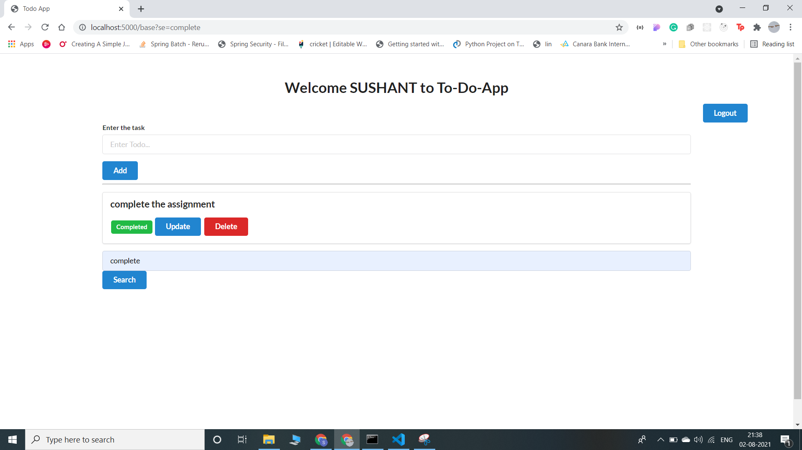

# TO-DO-APP 
In this to-do website we can new users can register and after that can login.After logging in users can see their names in the header. 
User can add the new task after clicking on add task button, user can change the status of the task once it is completed and if user want he/she can delete the task. 
User can search for the tasks in the search bar and see the results.

**Following are screenshots of to-do app**

**Register page**  
 
**login section**  
 
**Adding task to website**  
 
**After adding the task**  
 
**Changing the status of task**  
 
**after applying the search option**  
 
**Logout after clicking on the button**  
 
